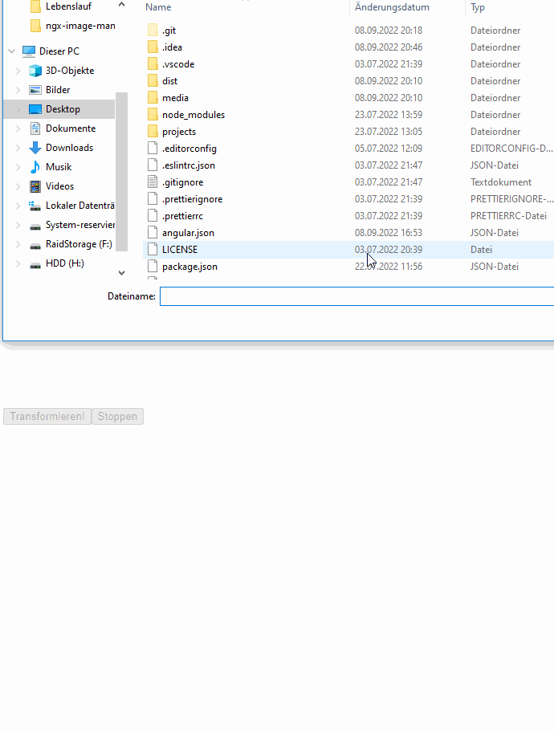

# Example of Edge Detection done with this library




# Usage

- Create your own class that extends the ImageManipulator class. In this class you place your methods that should be executed in a webworker.
Regarding image manipulation your method should have the signature `(data: ImageData) => Promise<ImageData>`, but basically you could put any code here,
that should be executed in the webworker. In your function you can call the progressCallback method from the ImageManipulator base class. Note: these calls
are also possible stopping points, if you want to cancle the execution of the method!
Here is an example class, that offers edge detection:
```
import { ImageManipulator } from 'ngx-image-manipulator';

export class ConcreteImageManipulator extends ImageManipulator {
  async edgeDetection(imageData: ImageData): Promise<ImageData> {
    await this.progressCallback(0);

    const result = new Uint8ClampedArray(imageData.data.length);
    result.fill(255);

    for (let x = 0; x < imageData.width; x++) {
      // We devide the loop over x in 10 progress steps
      if (x % Math.floor(imageData.width / 10) === 0) {
        await this.progressCallback(
          Math.floor(x / (imageData.width / 10)) * 10
        );
      }

      for (let y = 0; y < imageData.height; y++) {
        const index = (x + y * imageData.width) * 4;
        const indexLeft = index - 4;
        const indexRight = index + 4;
        const indexUp = index - imageData.width * 4;
        const indexDown = index + imageData.width * 4;
        if (
          x === 0 ||
          x === imageData.width - 1 ||
          y === 0 ||
          y === imageData.height - 1
        ) {
          result[index] = 255;
          result[index + 1] = 255;
          result[index + 2] = 255;
          continue;
        }

        const dxR = imageData.data[indexLeft] - imageData.data[indexRight];
        const dyR = imageData.data[indexUp] - imageData.data[indexDown];
        const magR = Math.sqrt(dxR * dxR + dyR * dyR);

        const dxG =
          imageData.data[indexLeft + 1] - imageData.data[indexRight + 1];
        const dyG = imageData.data[indexUp + 1] - imageData.data[indexDown + 1];
        const magG = Math.sqrt(dxG * dxG + dyG * dyG);

        const dxB =
          imageData.data[indexLeft + 1] - imageData.data[indexRight + 1];
        const dyB = imageData.data[indexUp + 1] - imageData.data[indexDown + 1];
        const magB = Math.sqrt(dxB * dxB + dyB * dyB);

        let max = magR;
        if (magG > max) {
          max = magG;
        }
        if (magB > max) {
          max = magB;
        }
        result[index] = max;
        result[index + 1] = max;
        result[index + 2] = max;
      }
    }

    await this.progressCallback(100);
    return new ImageData(result, imageData.width, imageData.height);
  }
}
```

- Create a regular web worker file (you can refer to the Angular documentation for this) and initialize your own ImageManipulator class like this:
```
/// <reference lib="webworker" />

import { initWebWorker } from 'ngx-image-manipulator';
import { ConcreteImageManipulator } from './concrete-manipulator';

initWebWorker(new ConcreteImageManipulator());
```

- Import the Module with forRoot. As first parameter you provide a lambda that creates a new Worker, which is required because the library has no information about the name and 
path of your web worker file. Second parameter is our own ImageManipulator class. This should be exactly the same as the one you used in the web worker file.
```
  ImageManipulationModule.forRoot(
  () => new Worker(new URL('test.worker', import.meta.url)),
  ConcreteImageManipulator
  )
```

- Now you can inject the Manipulation service:
```
  constructor(
    private readonly manipulatonService: ManipulationService<ConcreteImageManipulator>
  ) {}
```
The ManipulationService gives access to the ConcreteImageManipulator and to a progress subject.
Running multiple image transformations at the same time is supported, but progress won't work correctly and when stopping an execution, you have no guarantees, which
execution is stopped!

- You can use the ConcreteImageManipulator directly like this:
```
const worker = await this.manipulatonService.getWorker();
try{
  const resultingImageData = await worker.edgeDetection(inputImageData);
}catch(e){
  console.log('image data transformation was most likely cancelled.');
}
```

- You can also make use of the ImageManipulatorComponent, that will show the progress of the current transformation and emit events when a transformation is finished.
